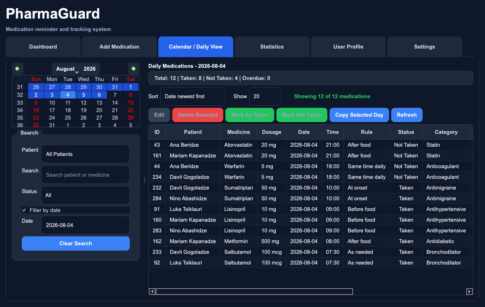
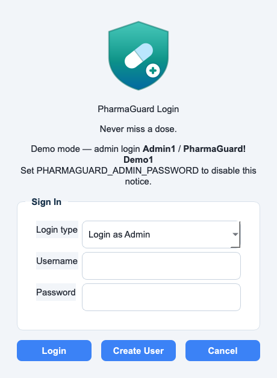
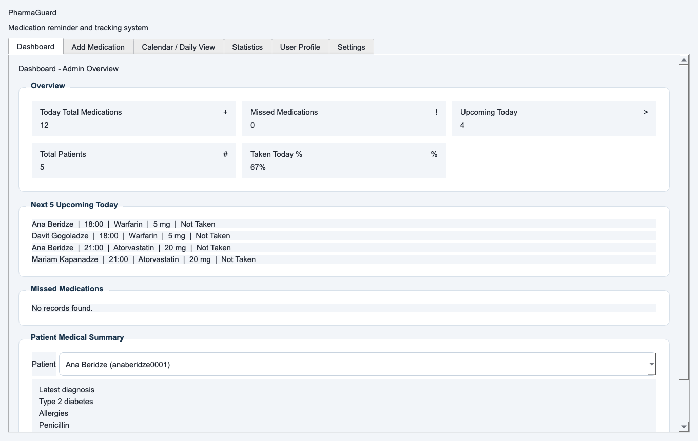
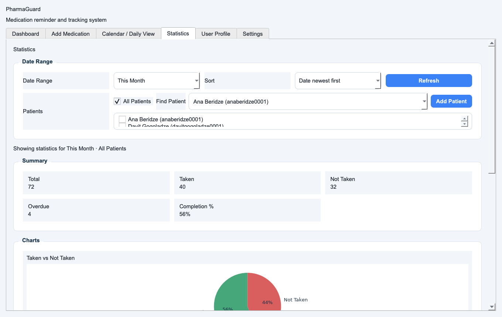
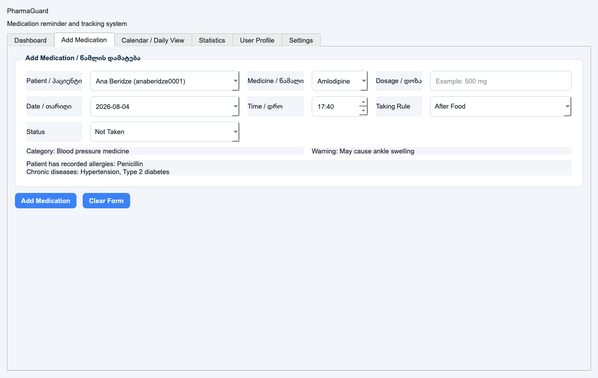
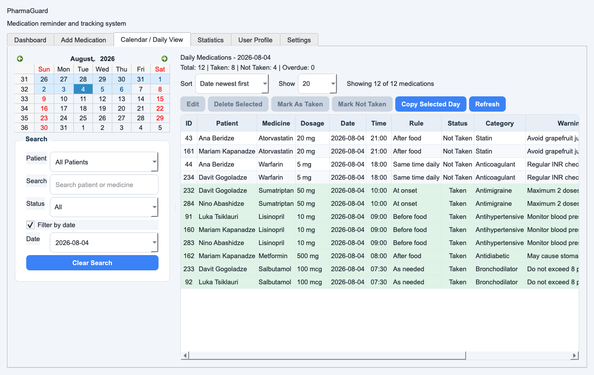
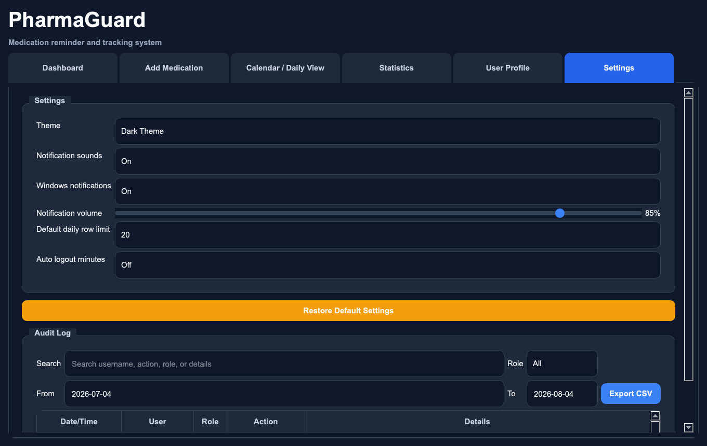

# PharmaGuard

A desktop medication reminder and adherence-tracking system for a small clinic or
care setting. One administrator manages patient accounts, prescriptions, and medical
history; each patient sees only their own schedule. A background scheduler raises
reminders ten minutes before a dose, at the dose time, and again when a dose is missed.



<p align="center">
  
  
  
  
</p>

---

## What this demonstrates

- **Desktop application architecture** — ~6,000 lines of PyQt5 split into models,
  services, and view layers, with signals crossing the thread boundary safely.
- **Relational data modelling** — five tables with forward-only migrations that
  upgrade an existing installation in place without losing records.
- **Credential handling** — salted PBKDF2-HMAC-SHA256, constant-time comparison, and
  a transparent upgrade path from a legacy hash format.
- **Background scheduling** — APScheduler driving time-window reminder logic that
  survives missed ticks.
- **Testing discipline** — 112 tests over auth, persistence, date arithmetic, and
  scheduler state transitions, all with injected clocks and throwaway databases.

## Features

**Accounts and access**
- Separate administrator and patient roles; patients see only their own records
- Auto-generated usernames (`anaberidze0001`) with collision handling
- Password policy: 8+ characters, upper, lower, digit, symbol
- Accounts can be deactivated without deletion; deactivated logins are refused with a reason
- Every login, failure, and record change is written to an append-only audit log

**Medication management**
- Add, edit, delete, search, and filter reminders
- Mark doses Taken / Not Taken; overdue state is derived, not stored
- Copy an entire day's schedule to another date
- Calendar and daily views filtered by date, patient, status, and free text
- Seven sort orders, including overdue-first
- Medicine reference data loaded from `medicine_info.csv`

**Reminders**
- Background checks every minute via APScheduler
- Three events per dose: ten minutes before, at the scheduled time, and missed
- In-app popups plus desktop notifications, each with its own audio cue
- Notification state persists, so a restart never re-fires an old reminder

**Clinical records and reporting**
- Per-patient medical history: diagnosis, allergies, chronic conditions, surgeries, notes
- Dashboard summarising today's doses, misses, upcoming times, and adherence rate
- Statistics tab with adherence charts over day / week / month / year / custom ranges
- Light and dark themes

## Screenshots

| | |
|---|---|
| <br>**Login** — role selection, with demo credentials shown only when no admin password is configured | <br>**Dashboard** — today's totals, upcoming doses, misses, and per-patient summary |
| <br>**Statistics** — adherence over a selected range, filtered by patient | <br>**Add medication** — scheduling with category and warning metadata |
| <br>**Calendar / daily view** — the main working surface | <br>**Settings** — theme, notification, and sound preferences |

Screenshots are generated, not hand-taken:
`QT_QPA_PLATFORM=offscreen python tools/capture_screenshots.py [--theme dark]`.

## Architecture

```
main.py                  entry point; owns the login -> main-window -> logout cycle
│
├── auth_manager.py      PBKDF2 hashing, password policy, admin/patient login
├── database.py          the only module that touches SQLite: schema, migrations, queries
├── scheduler.py         APScheduler job; emits Qt signals for due and missed doses
│
├── models
│   ├── user.py          User record and display helpers
│   └── medication.py    Medication record, time arithmetic, sort orders
│
├── views
│   ├── ui.py                 MainWindow, tab container, reminder popups
│   ├── login_dialog.py       login and account creation
│   ├── dashboard.py          summary cards
│   ├── statistics_window.py  matplotlib charts and range filters
│   ├── user_profile.py       profile, password change, medical history
│   ├── settings_tab.py       preferences
│   ├── dialogs.py            add/edit medication dialogs
│   └── patient_widgets.py    searchable and multi-select patient pickers
│
├── notification_manager.py   desktop notifications and audio cues
└── styles.py                 light and dark Qt stylesheets
```

**Data flow for a reminder.** `scheduler.py` wakes once a minute and asks
`database.py` for not-taken doses dated today or earlier. For each one it compares
the current time against three windows, writes the matching notification flag back to
the database, then emits `reminder_due`. Qt delivers that signal on the main thread,
where `ui.py` shows the popup and `notification_manager.py` plays the cue. The flag
write happens *before* the emit, so a crash mid-notification cannot produce a duplicate.

**Schema.** `users`, `medications`, `patient_medical_history`, `settings`, `audit_log`.
Migrations are forward-only and idempotent: each runs on every startup, checks
`PRAGMA table_info`, and adds only what is missing. One legacy column required a full
table rebuild, done with the data copied across inside a transaction.

## Quickstart

Requires Python 3.10 or newer.

```bash
git clone https://github.com/Moska25/PharmaGuard.git
cd PharmaGuard
python3 -m venv .venv && source .venv/bin/activate    # Windows: .venv\Scripts\activate
pip install -r requirements.txt
python seed_demo_data.py          # creates a local database with synthetic patients
python main.py
```

`seed_demo_data.py` prints the generated patient usernames. All demo patients use the
password `Demo!Pass1`.

**Administrator login.** Credentials come from the environment:

```bash
export PHARMAGUARD_ADMIN_USER=youradmin
export PHARMAGUARD_ADMIN_PASSWORD='choose-a-strong-one'
```

With nothing set the app runs in demo mode as `Admin1` / `PharmaGuard!Demo1` and says
so on the login screen. Do not run demo mode against real patient data.

## Testing

```bash
pip install -r requirements-dev.txt
QT_QPA_PLATFORM=offscreen python -m pytest tests/ -q
```

```
........................................................................ [ 64%]
........................................                                 [100%]
112 passed in 1.38s
```

The suite needs no display, no network, and no fixture database — every test builds
its own SQLite file under `tmp_path` and throws it away.

## Design decisions

**SQLite over a client/server database.** The deployment target is one machine in one
office with a single writer. SQLite removes the install step entirely, and the file is
backed up by copying it. The cost is no concurrent writers, which this workload never has.

**Reminders use time windows, not exact-minute equality.** The original scheduler
compared `now == scheduled_time`. If the machine slept, or a tick was delayed by so
much as sixty seconds, that reminder was skipped permanently and silently. For a
medication app that is the worst available failure mode, so each event now matches a
window and a late check still fires. `tests/test_scheduler.py` pins this behaviour.

**Overdue is computed, never stored.** A stored flag would be wrong the moment the
clock moved and would need a job to maintain it. `Medication.is_overdue()` derives it
from status and scheduled time, and takes an injectable reference time so the logic is
testable without waiting.

**PBKDF2 with a per-user salt, plus a migration path.** Earlier versions stored bare
SHA-256: unsalted and fast, which is exactly wrong for passwords, and it leaks the fact
that two users share a password whenever their digests match. Rather than force a
reset, `verify_password` accepts both formats and a successful login transparently
re-hashes to PBKDF2. Users notice nothing and the weak hash disappears on first sign-in.

**No database in the repository.** The app ships a seeder instead. An earlier version
of this repository committed a live database containing real names and password hashes.
Generated demo data is the only patient data that should ever exist here.

**The audit log is append-only.** No update or delete path exists. In a care setting,
the record of who changed a prescription matters as much as the prescription.

## Known limitations

- Single-user desktop app: no multi-machine sync and no server component.
- Notification delivery depends on the OS. `plyer` and `QSoundEffect` are guarded by
  try/except and degrade to in-app popups where unavailable.
- Reminders fire only while the app is running; there is no OS-level background service.
- The audit log has no UI-driven retention or export yet.
- Developed and primarily tested on Windows; verified to run on macOS.

## Roadmap

- Export adherence reports to PDF/CSV for a prescriber
- Drug-interaction warnings derived from the medicine reference data
- Optional encryption at rest for the SQLite file
- Packaged Windows installer attached to a GitHub release

## License

MIT
